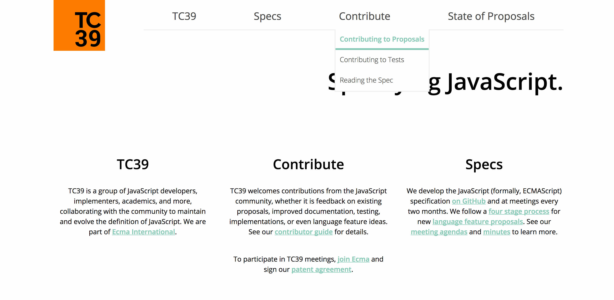

# TC39 website draft

The TC39 website aims to improve the web presense and host the documentation of the TC39. We want to
make the JavaScript spec more accessible and help people understand what the committee does!

This site is built using github pages and jekyll, and is currently in beta stage. We are looking for
feedback from people of all areas to get feedback.

## Getting involved

This project adheres to the TC39 [Code of Conduct](https://tc39.github.io/code-of-conduct/).

If you find that you are not getting the information you need the page, please comment on our
[usability thread](https://github.com/tc39/tc39-web-draft/issues/41) with
what you were looking for, and where you would have expected to find it! This kind of information
helps us understand what people's needs are and how we can improve this page to address those needs.

If you notice an issue with the website itself, such as accessibility issues, or web compatibility
issues, open a new issue and we will try to fix it!

You can also take on issues and help us improve the site.

Commits in pull requests should have a first line which starts with the issue number, followed by
the change that was made. For example:

`fix #32, add a footer`

If changes in the upstream master branch cause your PR to have conflicts, you should
rebase your branch to master and force-push it to your repo (rather than doing a
merge commit).

## Setting up your environment
Building the website requires [Docker](https://docs.docker.com/install/) This allows you to have a dev environment set up with Ruby and Bundler already installed, along with all the depenencies this project needs.

Once installed you should be able to get set up by running
`$ make install` - This will install all the Ruby dependencies plus the environment for you to run the site
`$ make build` - This runs Jekyll, and rebuilds the site folder
`$ make serve` - If you're developing this is a better option, as it will run Jekyll and watch for changes, this option also sets up a dev server on `localhost:8000`

## Discussion

We use IRC to communicate. The channel we use is #tc39-website on freenode. You can find
instructions for how to get online [here](https://freenode.net/kb/answer/chat)
